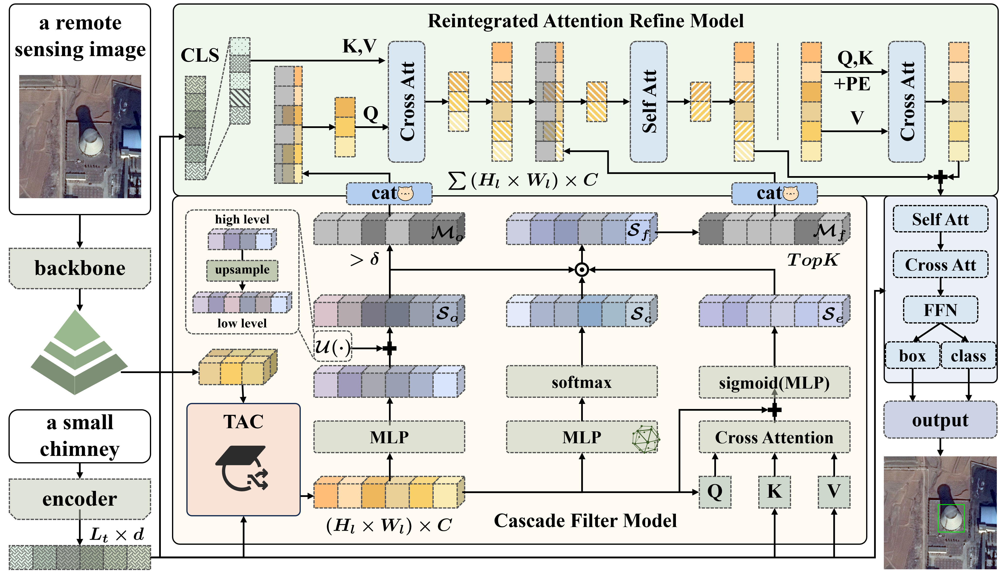
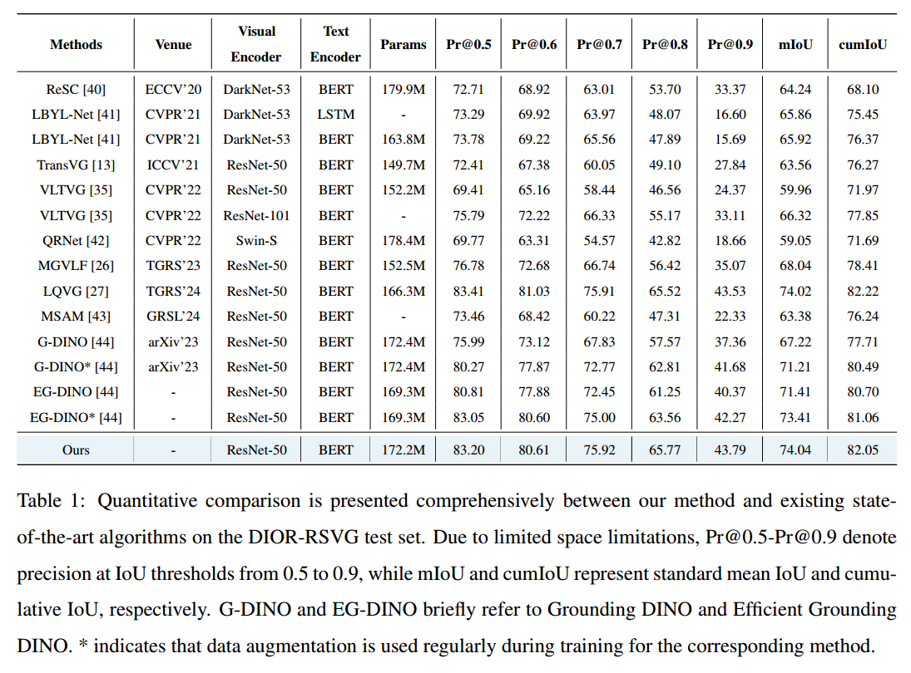
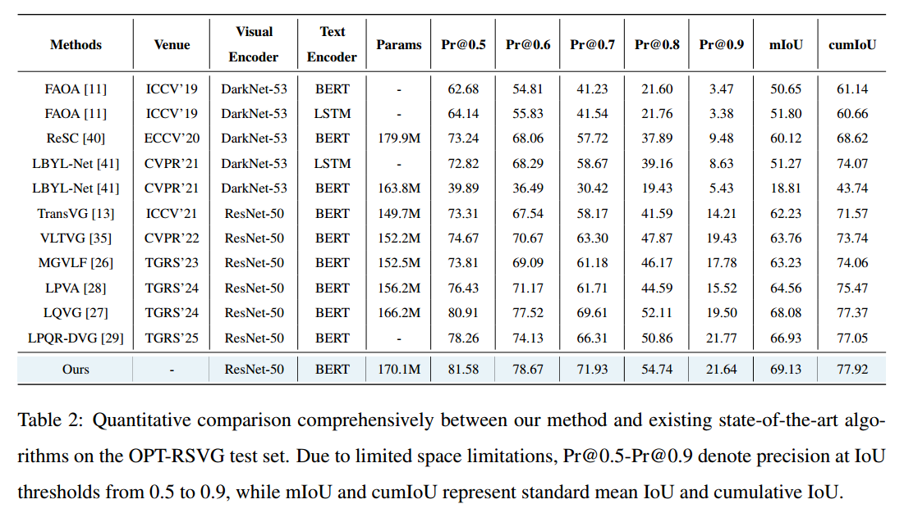

# PC<sup>2</sup>F: Language-Guided Progressive Calibration and Cascade Filtering for Remote Sensing Visual Grounding

Long Sun, Zhengyang Wang, Licheng Jiao, *Fellow, Life*, Xu Liu, Lingling Li, Xiaoqiang Lu, Fang Liu, Shuo Li, Dan Zhang, Xiaolin Tian, Xiaowen Zhang

Xidian University

---

## Table of Contents

- [Abstract](#?Abstract)
- [Setting Up](Setting Up)
  - [Preliminaries](#preliminaries)
  - [Initialization Weights for Training](#initialization-weights-for-training)
  - [Project Structure](#Project-Structure)
- [Results](#Results)

---

## Abstract

<figure align="center">
  
  <figcaption><em>Figure: Overall structure of PC<sup>2</sup>F.</em></figcaption>
</figure>


Remote Sensing Visual Grounding (RSVG) aims to localize target objects in high-resolution aerial imagery according to natural language queries. Compared with natural images, RSVG faces extreme scale variations, cluttered backgrounds, and a fundamental semantic gap between visual appearance and linguistic descriptions. In this paper, we propose a language-guided Progressive Calibration and Cascade Filtering framework (PC$^2$F) that jointly addresses these challenges through three tightly coupled modules. A Text-Aware Calibration Model (TAC) module injects linguistic guidance into early visual encoding via adaptive normalization. A Cascade Filter Model (CFM) performs language-guided coarse-to-fine token selection using a triple-gating mechanism that jointly evaluates foreground saliency, semantic relevance, and categorical distinctiveness. A Reintegrated Attention Refine Model (RAR) module reconstructs structurally coherent multi-scale features through dual-path attention, restoring fine-grained boundary details after token sparsification. Together, these modules establish a progressive pipeline: early semantic priming, multi-factor token filtering, and attention-based feature reconstruction. Extensive experiments on DIOR-RSVG and OPT-RSVG demonstrate the competitive performance of the proposed PC$^2$F framework. On DIOR-RSVG dataset, PC$^2$F achieves 83.20\% Pr@0.5, 75.92\% Pr@0.7, and 74.04\% meanIoU. On more challenging OPT-RSVG dataset, it obtains 69.13\% meanIoU, outperforming previous best results by 1.05 percentage points, with consistent gains across Pr@0.5-0.8.

---


## Setting Up

### Preliminaries

The code has been verified with **PyTorch v1.8.1** and **Python 3.8.19**.

1. Clone this repository  
2. Change directory to the repository root

### Package Dependencies

1. Create and activate the conda environment:

```bash
conda create -n PC2F python==3.8.19
conda activate PC2F
```

2. Install PyTorch v1.8.1 with a CUDA version that works on your machine (CUDA 11.1 in this example):

```bash
conda install pytorch==1.8.1+c111 torchvision==0.9.1+cu111 torchaudio==0.8.1 cudatoolkit=11.1 -c pytorch
```

3. Install remaining packages:

```bash
pip install -r requirements.txt
```

### Initialization Weights for Training

1. Create the directory to store pretrained weights:

```bash
mkdir ./pretrained_weights
```


2. Download **BERT** weights and put them in the repository root:  [BERT](https://huggingface.co/google-bert/bert-base-uncased)


------------------------------------------------------------------------

### Project Structure

/path/to/Code/Shell  
├── Ablation        #All ablation  
│   &emsp;&emsp;├── RISBench  
│   &emsp;&emsp;├── RRSIS-D  
│   &emsp;&emsp;└── RefSegRS  
└── Result          #All result 
      &emsp;&emsp;&emsp;├── RISBench  
      &emsp;&emsp;&emsp;├── RRSIS-D  
      &emsp;&emsp;&emsp;├── RefSegRS  
      &emsp;&emsp;&emsp;└── RefOPT  
### *Part I --- Ablation Experiments*

Ablation scripts evaluate the contribution of different modules and
hyperparameters.

### Step 1: Navigate to Ablation Directory

``` bash
cd /path/to/Code/Shell/Ablation
```

------------------------------------------------------------------------

#### 1 Module Combination Ablation (TAC / CFM / RAR)

**Example (RRSIS-D)**

Run training:

``` bash
bash Code/Shell/Ablation/DIOR-RSVG/train_TAC.sh
bash Code/Shell/Ablation/DIOR-RSVG/train_CFM.sh
bash Code/Shell/Ablation/DIOR-RSVG/train_RAR.sh
```

Run evaluation:

``` bash
bash Code/Shell/Ablation/DIOR-RSVG/test_TAC.sh
bash Code/Shell/Ablation/DIOR-RSVG/test_CFM.sh
bash Code/Shell/Ablation/DIOR-RSVG/test_RAR.sh
```

------------------------------------------------------------------------

### *Part II --- Final (Main) Experiments*
Final experiment scripts are located in:

    /path/to/Code/Shell/Result

These scripts reproduce the final reported results for each dataset.

#### Example Usage

**DIOR-RSVG**

``` bash
cd /path/to/Code/Shell/Result/DIOR-RSVG
bash train_DIOR.sh
bash test_DIOR.sh
```

**OPT-RSVG**

``` bash
cd /path/to/Code/Shell/Result/OPT-RSVG
bash train_OPT.sh
bash test_OPT.sh
```

------------------------------------------------------------------------


### Execution Tips

Make scripts executable:

``` bash
chmod +x *.sh
```

Run normally:

``` bash
bash script_name.sh
```

Run in background:

``` bash
nohup bash script_name.sh > output.log 2>&1 &
```


------------------------------------------------------------------------

## Results

Table 1: Comparison with SOTA methods on DIOR-RSVG  testing dataset. 

<figure align="center">
  
  <figcaption><em>Figure: Comparison with SOTA methods on DIOR-RSVG  testing dataset. .</em></figcaption>
</figure>

Table 2: Comparison with SOTA methods on OPT-RSVG validation and testing dataset. 

<figure align="center">
  
  <figcaption><em>Figure: Table 2: Comparison with SOTA methods on OPT-RSVG validation and testing dataset. </em></figcaption>
</figure>


